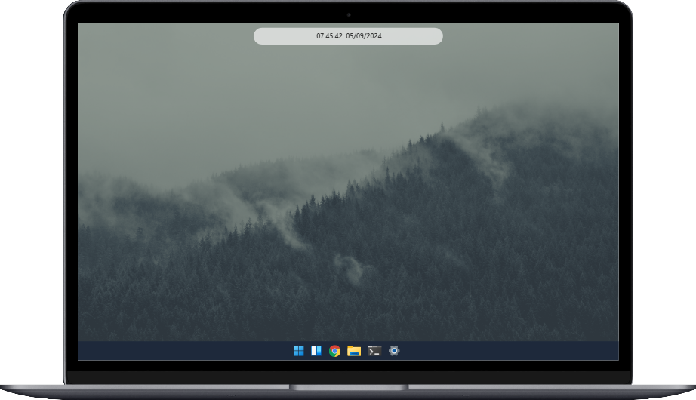

<h1 align="center">
  WinHeader
</h1>

<p align="center">
  <a href="#-layout">Layout</a>&nbsp;&nbsp;&nbsp;|&nbsp;&nbsp;&nbsp;
  <a href="#-tecnologias">Tecnologias</a>&nbsp;&nbsp;&nbsp;|&nbsp;&nbsp;&nbsp;
  <a href="#-licença">Licença</a>&nbsp;&nbsp;&nbsp;|&nbsp;&nbsp;&nbsp;
  <a href="#-contato">Contato</a>
</p>
<br>
<p>

</p>


## 🎨 Layout

Aqui você pode conferir o layout do projeto. <br>

[👉 Link para visualizar a pagina completa](https://projeto-nike.vercel.app/)


<br>
   

---

## 🚀 Tecnologias

Esse projeto foi desenvolvido com as seguintes tecnologias:


<br>
<br>
<br>
<br>
<br>


## Setup IDE recomendado

- [VSCode](https://code.visualstudio.com/) + [ESLint](https://marketplace.visualstudio.com/items?itemName=dbaeumer.vscode-eslint) + [Prettier](https://marketplace.visualstudio.com/items?itemName=esbenp.prettier-vscode)

## Scripts do projeto

### Instalação

```bash
$ npm install
```

### Desenvolvimento

```bash
$ npm run dev
```

### Build

```bash
# Para windows
$ npm run build:win

# Para macOS
$ npm run build:mac

# Para Linux
$ npm run build:linux
```

## 📝 Licença

Esse projeto está sob a licença MIT. Veja o arquivo [LICENSE](LICENSE) para mais detalhes.

## 🌐 Contato

<a href="https://www.linkedin.com/in/dev-gabriel-leite/" target="_blank"></a>
<a href = "mailto:gabrielleiteadm@gmail.com"></a>

<br>

---

Feito com ♥ by Gabriel Gonçalves 🖖 &nbsp;&nbsp;&nbsp;|&nbsp;&nbsp; <a href="#WinHeader">Voltar para o Inicio ⬆️ </a>